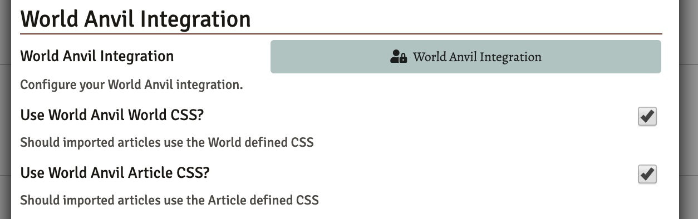
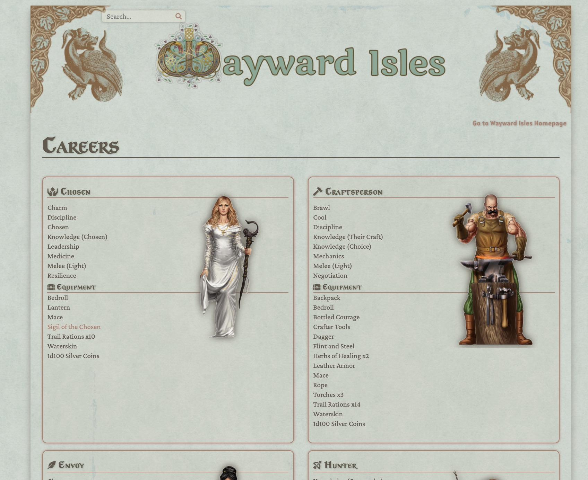
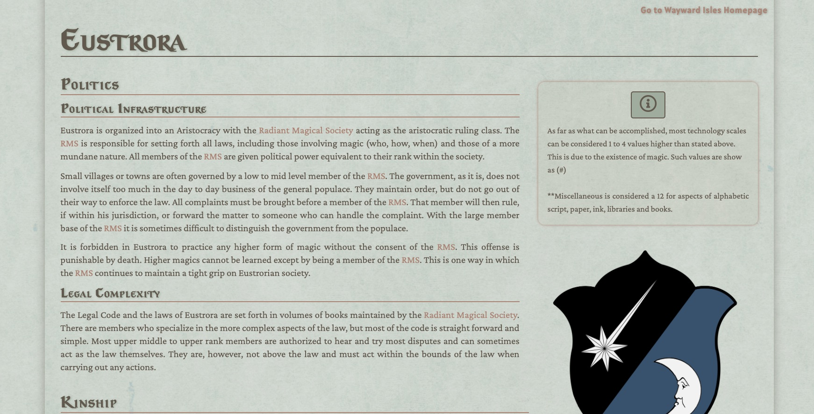
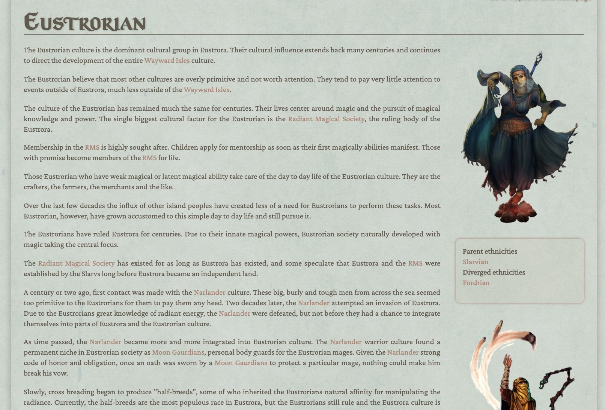
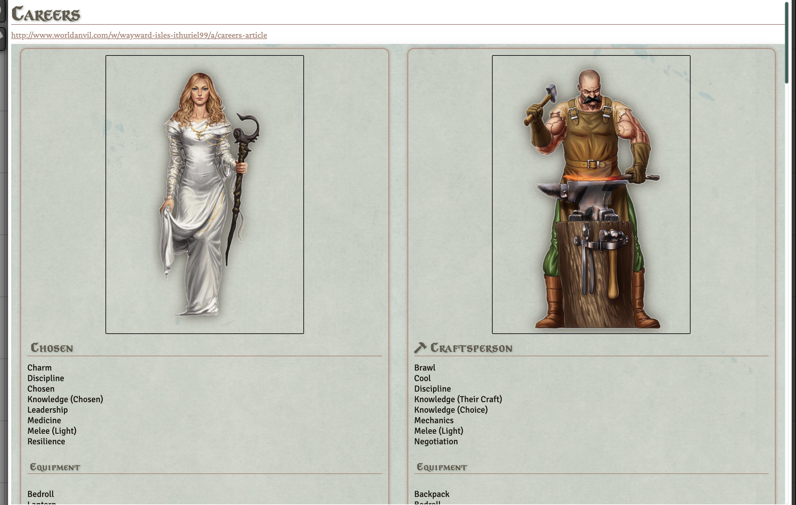
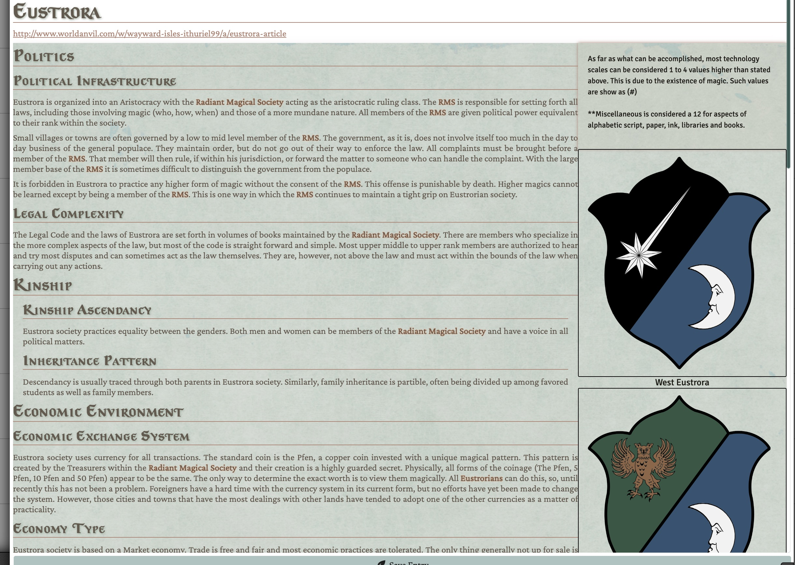
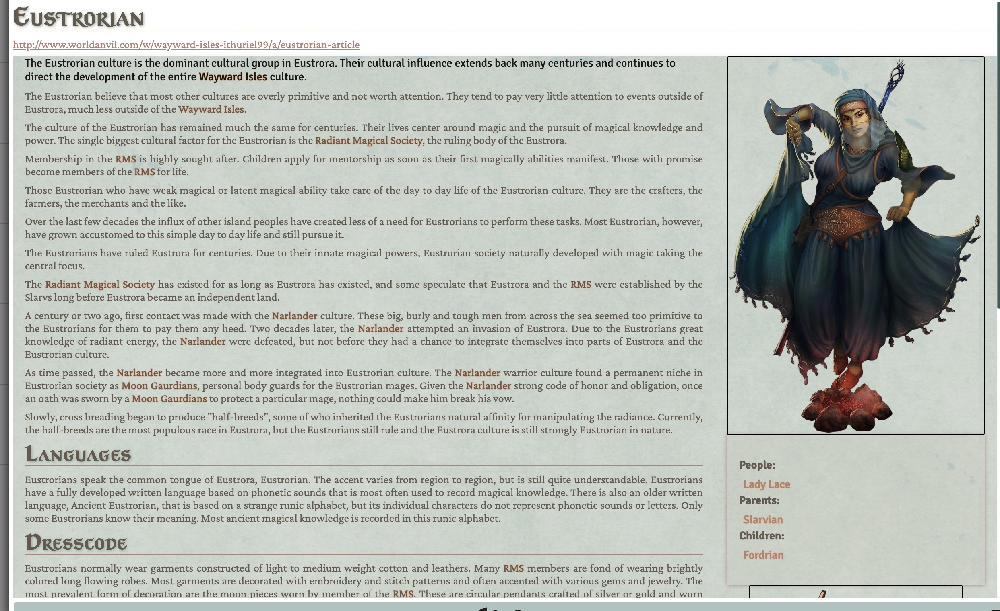

##Purpose
To allow for the importing of the world and article CSS and to use that CSS when
rendering the imported article.

##Changes
Apart from the addition of the CSS changes, the overall format was tweaked.
In addition, the look of a World Anvil link was reworked to not look like a 
button. This was just a personal preference and can be reverted with ease.

##Notes
I have 20+ years of development experience, but javascript is new to me, so the
code may not be best practice in parts. I learn by doing, and this is what I 
did.

It still needs some work, but this is the overall idea.

##Config

##Articles on World Anvil 
### 
### 
### 

##Imported Articles
### 
### 
### 